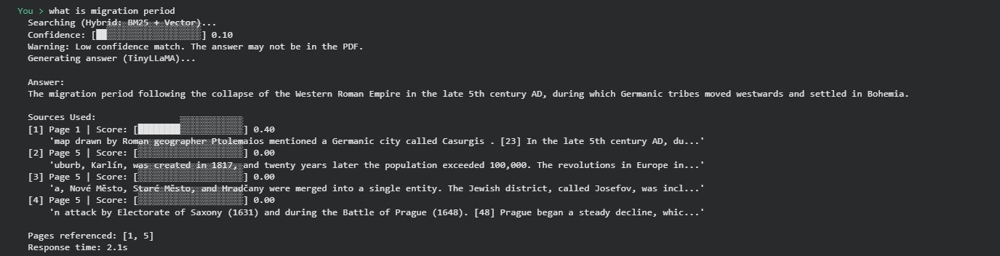
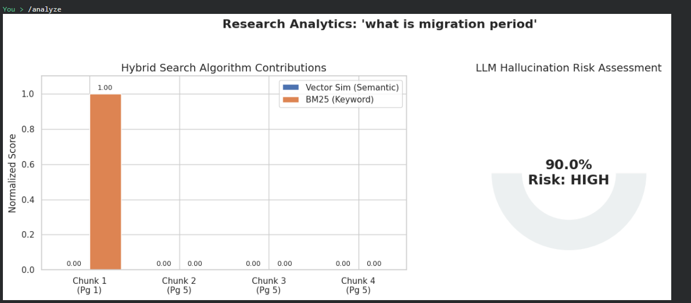
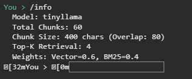
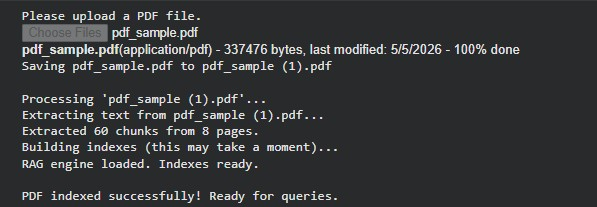

# 📄 RAG PDF Question-Answering Agent

<div align="center">


**A fully offline, explainable Retrieval-Augmented Generation (RAG) system that lets you upload any PDF and ask natural-language questions -  powered by hybrid BM25 + vector search and a locally-running LLM.**

[Features](#-features) • [Architecture](#-architecture) • [Demo](#-demo) • [Quick Start](#-quick-start) • [Configuration](#-configuration) • [Roadmap](#-roadmap)

</div>

---

## 🧠 What Is This?

This project implements a production-pattern **RAG pipeline** entirely within Google Colab. You upload a PDF, the system indexes it using a dual retrieval strategy (BM25 keyword search + ChromaDB semantic vector search), and a lightweight local LLM (TinyLLaMA 1.1B via Ollama) generates grounded, cited answers.

Every response comes with:
- ✅ **Exact page references** and text previews for full explainability
- ✅ **A 0.0–1.0 confidence score** with colour-coded visual feedback
- ✅ **Hallucination risk analysis** visualised as a gauge chart
- ✅ **Hybrid search contribution breakdown** (BM25 vs. Vector) per retrieved chunk

---

## ✨ Features

| Feature | Description |
|---|---|
| 🔍 **Hybrid Search** | Weighted blend of BM25 (40%) + ChromaDB cosine similarity (60%) — same pattern used in Elasticsearch production systems |
| 📊 **Confidence Scoring** | Real-time 0.0–1.0 score averaged from top-K chunk blend scores, rendered as a green/yellow/red bar |
| 📑 **Source Grounding** | Every answer cites page numbers and 120-char text previews of retrieved chunks |
| ⚠️ **Hallucination Detection** | Low-confidence warning; `/analyze` renders a risk gauge chart |
| 🖥️ **CLI Interface** | Interactive REPL with `/help`, `/sources`, `/info`, `/analyze`, `/exit` commands and coloured output |

---

## 🏗️ Architecture

```
┌──────────────────────────────────────────────────────────────────────┐
│                         RAG PIPELINE                                 │
│                                                                      │
│  ┌─────────┐    ┌──────────────┐    ┌─────────────────────────────┐ │
│  │  PDF    │───▶│  Chunker     │───▶│   Dual Indexing             │ │
│  │ Upload  │    │ 400 chars /  │    │                             │ │
│  │ (pypdf) │    │ 80 overlap   │    │  ┌───────────┐ ┌─────────┐ │ │
│  └─────────┘    └──────────────┘    │  │ ChromaDB  │ │  BM25   │ │ │
│                                     │  │ (Vectors) │ │(Keyword)│ │ │
│                                     │  └───────────┘ └─────────┘ │ │
│                                     └─────────────────────────────┘ │
│                                                    │                 │
│  ┌──────────┐    ┌────────────────────────────┐   │                 │
│  │  User    │───▶│    Hybrid Search           │◀──┘                 │
│  │  Query   │    │  60% Vector + 40% BM25     │                     │
│  └──────────┘    └─────────────┬──────────────┘                     │
│                                │                                     │
│                  ┌─────────────▼──────────────┐                     │
│                  │  Top-K Chunks + Confidence  │                     │
│                  │  Score + Source Metadata    │                     │
│                  └─────────────┬──────────────┘                     │
│                                │                                     │
│                  ┌─────────────▼──────────────┐                     │
│                  │  Prompt Builder             │                     │
│                  │  (Context-Only Grounding)   │                     │
│                  └─────────────┬──────────────┘                     │
│                                │                                     │
│                  ┌─────────────▼──────────────┐                     │
│                  │  TinyLLaMA via Ollama       │                     │
│                  │  (localhost:11434)          │                     │
│                  └─────────────┬──────────────┘                     │
│                                │                                     │
│                  ┌─────────────▼──────────────┐                     │
│                  │  Answer + Citations +       │                     │
│                  │  Confidence + Sources       │                     │
│                  └────────────────────────────┘                      │
└──────────────────────────────────────────────────────────────────────┘
```

### How the Hybrid Score Works

```
final_score = (0.6 × vector_cosine_similarity) + (0.4 × BM25_normalised_score)
```

The BM25 model performs well for keyword matching. On the other hand, the vector space model is better at detecting semantically similar terms. Combining the two techniques leads to a more effective search than either approach individually, as proven in today’s information retrieval studies.

---

## 📸 Demo

### Asking a Question — Full RAG Pipeline in Action

> The system searches using Hybrid BM25 + Vector, displays a confidence bar, generates an answer, and shows ranked sources with page numbers and text previews.

### `/analyze` — Research Analytics Dashboard

> After any query, `/analyze` renders: (1) a stacked bar chart breaking down BM25 vs. Vector contributions per chunk, and (2) a hallucination risk gauge derived from the inverse confidence score.

### `/info` — System Configuration Inspector

> Shows the active model, total indexed chunks, chunk size/overlap, Top-K retrieval setting, and BM25/Vector weight configuration.

### PDF Indexing — Upload & Processing

> After uploading a PDF, the system extracts text, splits it into overlapping chunks, builds BM25 and ChromaDB indexes, and confirms readiness.

### `/sources` — Document Page Inventory

> Lists all page numbers present in the loaded PDF for quick document orientation.

---

## 🚀 Quick Start

### Prerequisites

- A Google account with access to [Google Colab](https://colab.research.google.com)
- A PDF file to query
- **No local installation required**

### Steps

```bash
# 1. Open the notebook in Google Colab
#    File > Upload notebook > Select RAG_Pdf_Q_A.ipynb

# 2. (Recommended) Set runtime to GPU
#    Runtime > Change runtime type > T4 GPU
#    This cuts response time from ~60s → ~10s

# 3. Run cells in order:
#    Cell 1 — Install dependencies (chromadb, pypdf, rank_bm25, colorama)
#    Cell 2 — Install Ollama + pull TinyLLaMA 
#    Cell 3 — Load all RAG engine functions
#    Cell 4 — Upload your PDF (file chooser appears)
#    Cell 5 — Start the interactive CLI
```

### Example Session

```
You > What is the main contribution of this paper?
  Searching (Hybrid: BM25 + Vector)...
  Confidence: [████████████████░░░░] 0.78
  Generating answer (TinyLLaMA)...

  Answer:
  The main contribution is a novel attention mechanism that reduces...

  Sources Used:
  [1] Page 2 | Score: [████████████████░░░░] 0.81
      'We propose a new self-attention variant that operates in O(n log n)...'

  Pages referenced: [2, 3]
  Response time: 14.3s

You > /analyze
  [displays retrieval analytics dashboard]

You > /sources
  PDF has 12 pages: [1, 2, 3, 4, 5, 6, 7, 8, 9, 10, 11, 12]

You > /exit
  Goodbye!
```

---

## ⚙️ Configuration

All parameters are defined as constants at the top of Cell 3. 

| Parameter | Default | Effect |
|---|---|---|
| `MODEL_NAME` | `tinyllama` | Ollama model for generation. Swap to `mistral` for higher quality. |
| `CHUNK_SIZE` | `400` | Characters per chunk. Smaller = finer retrieval granularity. |
| `CHUNK_OVERLAP` | `80` | Character overlap between chunks. Prevents context loss at boundaries. |
| `TOP_K` | `4` | Chunks retrieved and sent to the LLM. Higher = more context, longer prompts. |
| `BM25_WEIGHT` | `0.4` | Keyword retrieval weight. Must sum to 1.0 with `VECTOR_WEIGHT`. |
| `VECTOR_WEIGHT` | `0.6` | Semantic retrieval weight. |
| `TEMPERATURE` | `0.2` | LLM temperature. Low = factual. Higher = more creative responses. |
| `NUM_PREDICT` | `300` | Max tokens in LLM response. Kept low for speed. |
| `NUM_CTX` | `2048` | LLM context window size. Increase for longer retrieved passages. |

---

## 🛠️ Tech Stack

| Technology | Version | Role |
|---|---|---|
| **Python** | 3.10+ | Core language |
| **ChromaDB** | Latest | Vector database with cosine similarity retrieval |
| **Ollama** | Latest | Local LLM runtime (REST API on `localhost:11434`) |
| **TinyLLaMA** | 1.1B params | Lightweight LLM for answer generation |
| **rank_bm25** | Latest | BM25Okapi keyword retrieval |
| **pypdf** | Latest | PDF text extraction (page-by-page) |
| **colorama** | Latest | Cross-platform terminal colour output |
| **matplotlib / seaborn** | Latest | Analytics dashboard visualisation |
| **Google Colab** | Free Tier | Cloud runtime (CPU/T4 GPU) |

---

## ⚠️ Known Limitations

- **Model capability**: TinyLLaMA (1.1B) has limited multi-step reasoning. For complex analytical questions, swap `MODEL_NAME` to `mistral` (7B).
- **Scanned PDFs**: `pypdf` extracts machine-readable text only. Image-only PDFs return no content. OCR is not included in this version.
- **Session persistence**: ChromaDB and BM25 indexes are in-memory. Colab session resets require re-running Cell 4 to re-index.
- **Inference speed**: ~30–90 seconds per query on CPU. ~5–15 seconds on T4 GPU.
- **Large PDFs**: Documents with 200+ pages may take 30–60 seconds to index during embedding generation.

---

## 🗺️ Roadmap — Future Implementations

These are the improvements I've identified and would implement given more time or resources:

- [ ] **OCR Support** — Integrate `pytesseract` or `easyocr` to handle scanned/image-only PDFs
- [ ] **Persistent Storage** — Replace in-memory ChromaDB with a persistent client so indexes survive Colab session resets
- [ ] **Multi-PDF Support** — Allow indexing multiple PDFs simultaneously with per-source filtering
- [ ] **Query Expansion** — Use the LLM to rewrite or expand the user's query before retrieval (HyDE — Hypothetical Document Embeddings)
- [ ] **Gradio / Streamlit UI** — Replace the CLI with a web interface so the project is accessible without terminal familiarity
- [ ] **Docker Container** — Package Ollama + the RAG engine into a single Docker image for one-command local deployment
- [ ] **Fine-tuned Embeddings** — Replace ChromaDB's default sentence-transformers with a domain-specific embedding model fine-tuned on the target document type
- [ ] **Conversation Memory** — Add multi-turn support so follow-up questions ("And what about that in Chapter 3?") carry context from previous turns

---

## 📚 What I Learned

This project gave me hands-on experience with concepts that are directly applicable to production ML systems:

**Information Retrieval**
- Why pure vector search fails on keyword-heavy queries and why BM25 complements it.
- How BM25 score normalisation works and why raw scores can't be directly blended with cosine similarities without normalisation

**LLM Engineering**
- The practical tradeoffs between model size (1.1B vs 7B), inference speed and answer quality on resource-constrained hardware

**MLOps & Systems**
- How vector databases (ChromaDB) handle document storage, embedding generation and similarity queries under the hood
- The importance of chunk overlap: without it, relevant context that spans a boundary is silently lost

**Product Thinking**
- Confidence scores and source grounding aren't optional extras, they are essential for users to trust and correctly use an AI system
- Hallucination risk visualisation gives non-technical users a mental model for when to trust the output


</div>
